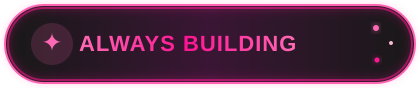
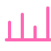

<!-- NEON SAKURA • PASTEL PINK GITHUB PROFILE -->

 

<table width="100%" cellpadding="0" cellspacing="0">
<tr>
<td width="60%" valign="top">

I'm a **B.Tech AI & ML student and developer** passionate about building practical and meaningful technology.

✦ Currently pursuing **B.Tech in Artificial Intelligence & Machine Learning**  
✦ Focused on **AI/ML, Full-Stack Development & real-world applications**  
✦ Building with **Python, Java, C, SQL & JavaScript**  
✦ Working with **Flask, FastAPI, Streamlit & REST APIs**  
✦ Exploring **Anomaly Detection, TensorFlow, TensorFlow.js & Data Analysis**  
✦ Worked on **SIH, hackathons and multiple real-world projects**  
✦ Building and deploying working software instead of only ideas  
✦ Always exploring new technologies and improving my development skills  
✦ Ask me about **AI/ML, Web Development & Project Building**  
✦ Fun fact: **I turn ideas into working products!**

 

> **"Build something useful. Learn something new. Repeat."** ♥

</td>

<td width="40%" align="center" valign="middle">

  

</td>
</tr>
</table>

<table width="100%">
<tr>
<td align="center" width="20%">
<b>Languages</b>  

</td>
<td align="center" width="20%">
<b>AI / ML</b>  

</td>
<td align="center" width="20%">
<b>Web & Backend</b>  

</td>
<td align="center" width="20%">
<b>Databases & Cloud</b>  

</td>
<td align="center" width="20%">
<b>Tools</b>  

</td>
</tr>
</table>

 

  

 

  

 

<table width="100%" cellpadding="0" cellspacing="8" style="border-collapse:separate;border-spacing:8px;">
<tr>

<td width="20%" align="center" valign="top" style="background:#11161F;border:1px solid #303844;border-radius:14px;padding:12px 8px;">

 
<a href="https://ayushkushwaha020.github.io/DX_TECHIES/"><b>DX TECHIES</b></a>
 
<small><b>AI Crowd Monitoring</b> SIH Ideas • <b>SIH26187</b></small>
  
Web App
AI
Hackathon
</td>

<td width="20%" align="center" valign="top" style="background:#11161F;border:1px solid #303844;border-radius:14px;padding:12px 8px;">

 
<a href="https://anomaly-detection-xxmd.onrender.com"><b>CODE.KAISEN</b></a>
 
<small><b>Anomaly Detection</b> SIH Ideas • <b>SIH26170</b></small>
  
Python
ML
Data Analysis
</td>

<td width="20%" align="center" valign="top" style="background:#11161F;border:1px solid #303844;border-radius:14px;padding:12px 8px;">

 
<a href="https://patient-case-taking-system-8zlk.onrender.com"><b>ALGOMINDS</b></a>
 
<small><b>Patient Case Taking</b> SIH 2026 • <b>SIH26047</b></small>
  
AI
Healthcare
NLP
</td>

<td width="20%" align="center" valign="top" style="background:#11161F;border:1px solid #303844;border-radius:14px;padding:12px 8px;">

 
<a href="https://student-attendance-system-pbl.onrender.com"><b>AI Student Attendance</b></a>
 
<small><b>Face Recognition Attendance</b> Camera • Web App</small>
  
Computer Vision
Web App
</td>

<td width="20%" align="center" valign="top" style="background:#11161F;border:1px solid #303844;border-radius:14px;padding:12px 8px;">

 
<a href="https://ayu-pr-pbl.onrender.com/ui/"><b>PR-CoPilot</b></a>
 
<small><b>AI-Powered PR Review Agent</b> GitHub • RAG • Automation</small>
  
AI
GitHub
Automation
</td>

</tr>
</table>

&nbsp;

&nbsp;

<blockquote>
<b>"The best way to predict the future is to invent it."</b> 
— Alan Kay
</blockquote>

 

