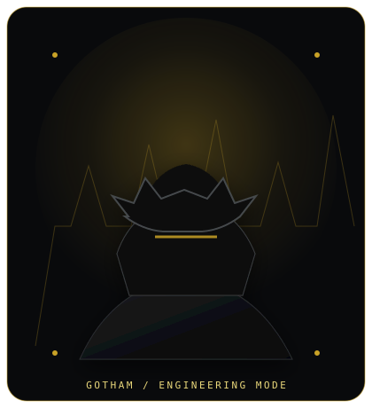
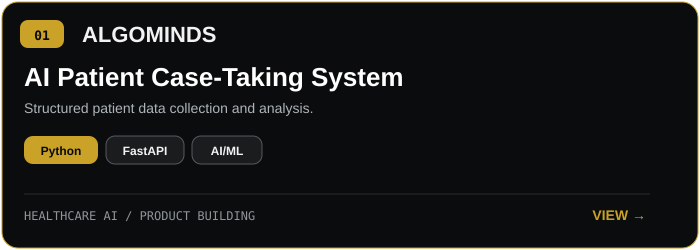
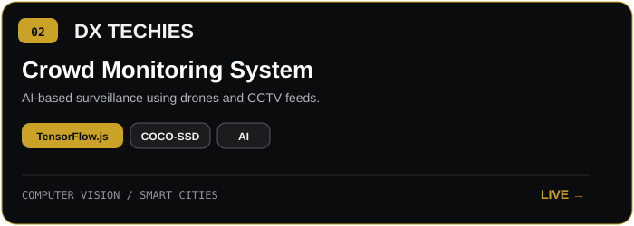
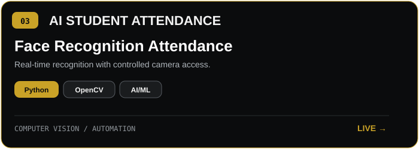

<!-- VERSION 4 — RECRUITER / GOTHAM ENGINEERING -->

  

 

  

 

  
  

 

  

<table width="100%" cellpadding="18" cellspacing="0">
<tr>
<td width="68%" valign="top">

## AYUSH KUSHWAHA

**B.TECH AI & ML** · Developer · Builder

B.Tech AI & ML student focused on building practical **AI/ML and full-stack applications**, with an emphasis on turning ideas into usable software.

**Core focus**

AI/ML & data-driven applications · Full-stack development & REST APIs · Computer vision & automation · Project development & deployment

**Technical direction**

Python, Java, C++, JavaScript/TypeScript, FastAPI, Flask, Streamlit, TensorFlow, TensorFlow.js, OpenCV and modern web technologies.

</td>
<td width="32%" align="center" valign="middle">
  
</td>
</tr>
</table>

 

  

<table width="100%" cellpadding="15" cellspacing="0">
<tr>
<td align="center" width="33%"><b>HACKATHON RUNNER-UP</b> BAD: Build After Dark</td>
<td align="center" width="33%"><b>SMART INDIA HACKATHON</b> Internal Qualifier</td>
<td align="center" width="33%"><b>POSTER PRESENTATION</b> ICAIDISS 2026</td>
</tr>
</table>

 

  

<table width="100%" cellpadding="12" cellspacing="0">
<tr>
<td valign="top" width="20%"><b>Languages</b>      </td>
<td valign="top" width="20%"><b>AI / ML</b>     </td>
<td valign="top" width="20%"><b>Web / Backend</b>       </td>
<td valign="top" width="20%"><b>Data / Cloud</b>     </td>
<td valign="top" width="20%"><b>Tools</b>      </td>
</tr>
</table>

 

  

<table width="100%" cellpadding="7" cellspacing="0">
<tr>
<td width="50%" align="center">
  
</td>
<td width="50%" align="center">
  
</td>
</tr>
<tr>
<td colspan="2" align="center">
  
</td>
</tr>
</table>

  <b>Additional work:</b> <a href="https://anomaly-detection-xxmd.onrender.com">CODE.KAISEN</a> · <a href="https://ayu-pr-pbl.onrender.com/ui/">PR-CoPilot</a>

 

  

  
   
  

 

  
    
  
  
  

 

  AI/ML student • developer • builder

