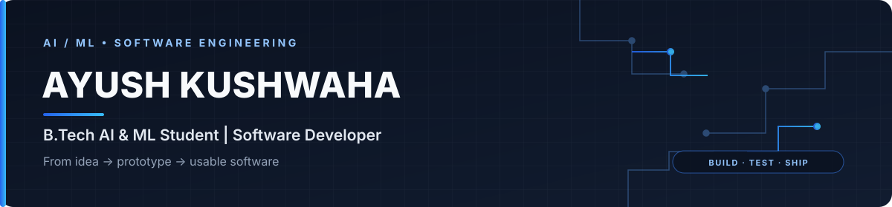
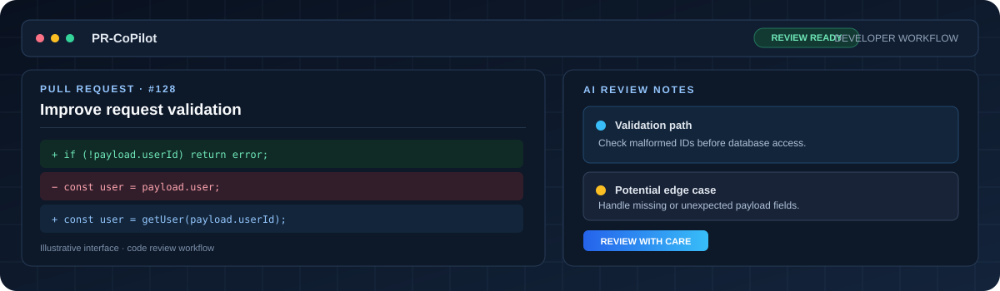
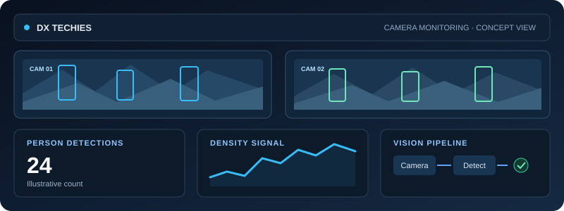
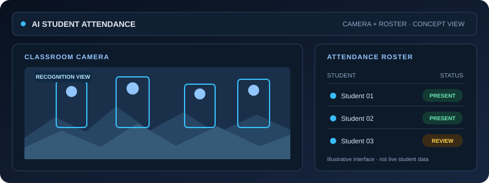
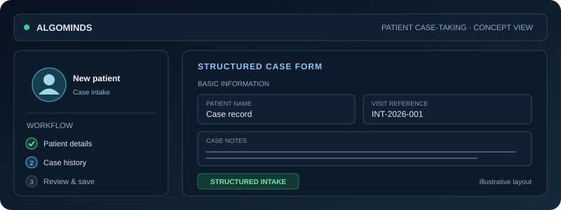
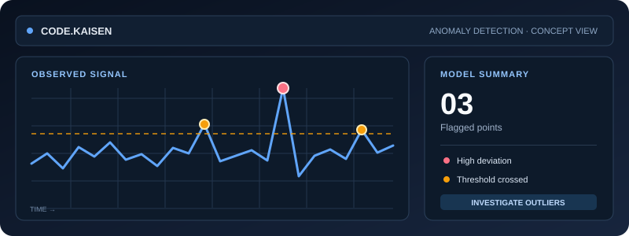
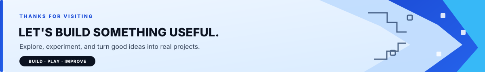

<!-- VERSION 5 · FINAL VISUAL PORTFOLIO -->

  

## Basic Introduction

  <h1>Ayush Kushwaha</h1>
  
<strong>B.Tech AI &amp; ML Student&nbsp; · &nbsp;Software Developer&nbsp; · &nbsp;Video Game Developer</strong>

  
I build AI-powered tools, interactive experiences, and practical software.

  

    
    
    
    
  

  

    
    
  

## About Me

I'm a B.Tech student specializing in **Artificial Intelligence and Machine Learning** who learns by building and improving real projects.

- **I explore:** applied AI/ML, computer vision, developer tools, and interactive software.
- **I build:** prototypes, APIs, web applications, and automation workflows.
- **My approach:** understand the problem, ship a useful first version, then refine it with feedback.
- **Recognition:** BAD: Build After Dark Hackathon — Runner-up; ICAIDISS 2026 — Poster Presentation Award.

---

## Featured Projects

<table width="100%" cellpadding="0" cellspacing="0" border="0">
  <tr>
    <td width="58%" valign="middle">
      
    </td>
    <td width="42%" valign="middle">
      
<strong>01 / PRIMARY PROJECT</strong>

      <h2>PR-CoPilot</h2>
      
An AI-assisted pull-request review tool exploring smarter developer workflows.

      
<strong>Focus</strong> AI Workflows · GitHub · Automation

      
<a href="https://ayu-pr-pbl.onrender.com/ui/"><strong>Open live demo →</strong></a>

      
<a href="https://github.com/ayushkushwaha020/PR-CoPilot-Agent">Explore source code</a>

    </td>
  </tr>
</table>

<table width="100%" cellpadding="10" cellspacing="8" border="0">
  <tr>
    <td width="50%" bgcolor="#0B1728" valign="top">
      
      <h3>02 · DX TECHIES</h3>
      
<strong>AI Crowd Monitoring System</strong>

      
Computer-vision prototype exploring person detection and crowd awareness.

      
TensorFlow.js · COCO-SSD · Computer Vision

      <a href="https://github.com/ayushkushwaha020/DX_TECHIES">Repository</a> · <a href="https://ayushkushwaha020.github.io/DX_TECHIES/">Live demo</a>
    </td>
    <td width="50%" bgcolor="#0B1728" valign="top">
      
      <h3>03 · AI Student Attendance</h3>
      
<strong>Face Recognition Attendance System</strong>

      
Explores camera-based recognition and attendance review workflows.

      
Python · OpenCV · AI/ML

      <a href="https://github.com/ayushkushwaha020/student-attendance-system_PBL">Repository</a> · <a href="https://student-attendance-system-pbl.onrender.com">Live demo</a>
    </td>
  </tr>
  <tr>
    <td width="50%" bgcolor="#0B1728" valign="top">
      
      <h3>04 · Patient Test-Taking System (ALGOMINDS)</h3>
      
<strong>Patient Case-Taking System</strong>

      
A structured workflow for collecting and organizing patient case information.

      
Python · FastAPI · Healthcare Workflow

      <a href="https://github.com/ayushkushwaha020/PATIENT-CASE-TAKING-SYSTEM">Repository</a> · <a href="https://patient-case-taking-system-8zlk.onrender.com">Live demo</a>
    </td>
    <td width="50%" bgcolor="#0B1728" valign="top">
      <h3>05 · More Projects</h3>
      
Explore additional experiments in machine learning, anomaly detection, and software development.

      
<a href="#other-projects"><strong>See other projects ↓</strong></a>

      
<a href="https://github.com/ayushkushwaha020?tab=repositories">All repositories →</a>

    </td>
  </tr>
</table>

Project visuals are custom illustrations for this README, not screenshots of live application screens.

## Other Projects

<table width="100%" cellpadding="10" cellspacing="8" border="0">
  <tr>
    <td width="45%" valign="top">
      
    </td>
    <td width="55%" valign="top">
      <h3>CODE.KAISEN · AI Anomaly Detection</h3>
      
A machine-learning project focused on identifying unusual patterns in data.

      
Python · Machine Learning · Data Analytics

      <a href="https://github.com/ayushkushwaha020/ANOMALY-DETECTION">Repository</a> · <a href="https://anomaly-detection-xxmd.onrender.com">Live demo</a>
    </td>
  </tr>
</table>

<a href="https://github.com/ayushkushwaha020?tab=repositories"><strong>Explore all repositories →</strong></a>

---

## Tech Stack

<table width="100%" cellpadding="12" cellspacing="8" border="0">
  <tr>
    <td width="50%" bgcolor="#07111F" valign="top">
      
<strong>Languages</strong>

      
    </td>
    <td width="50%" bgcolor="#07111F" valign="top">
      
<strong>AI / Machine Learning</strong>

      
    </td>
  </tr>
  <tr>
    <td width="50%" bgcolor="#17314F" valign="top">
      
<strong>Web &amp; Backend</strong>

      
    </td>
    <td width="50%" bgcolor="#17314F" valign="top">
      
<strong>Data &amp; Tools</strong>

      
    </td>
  </tr>
</table>

---

## GitHub Activity & Contribution Rhythm

  
  

Each heatmap square uses the contribution intensity supplied by the data source. Hover a day to see its date and count.

---

## Contact Me

Open to thoughtful feedback, project collaboration, and opportunities to build useful software.

  
  
  
  

<strong>Instagram:</strong> Ayush Kushwa &nbsp;·&nbsp; <strong>Handle:</strong> @ayushkushwah4852

---

## Daily Developer Quotes

  

A curated engineering quote selected by GitHub Actions and refreshed daily.

  

